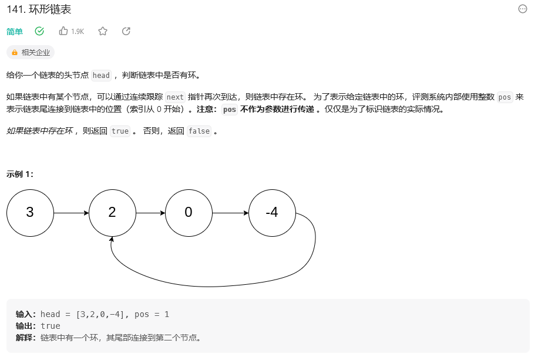

&emsp;&emsp;本题目中需要判断链表是否为环形，实际上只需要设置两个快慢节点即可，slow每走一步，fast走两步，如果是环形，那么fast必然会追上slow不过不是，即在循环内判断fast节点，同时还要注意，循环的判断条件为slow是否等于fast，所以初始化快慢节点的时候不能把两个节点都设为head，但如果把slow节点设为head.next，那么下一轮循环二者就相等了，代码如下：

```
class Solution:
    def hasCycle(self, head: Optional[ListNode]) -> bool:
        if not head or not head.next:
            return False 
        fast = head.next
        slow = head
        while fast != slow:
            if not fast or not fast.next:
                return False
            slow = slow.next
            fast = fast.next.next
        return True
```