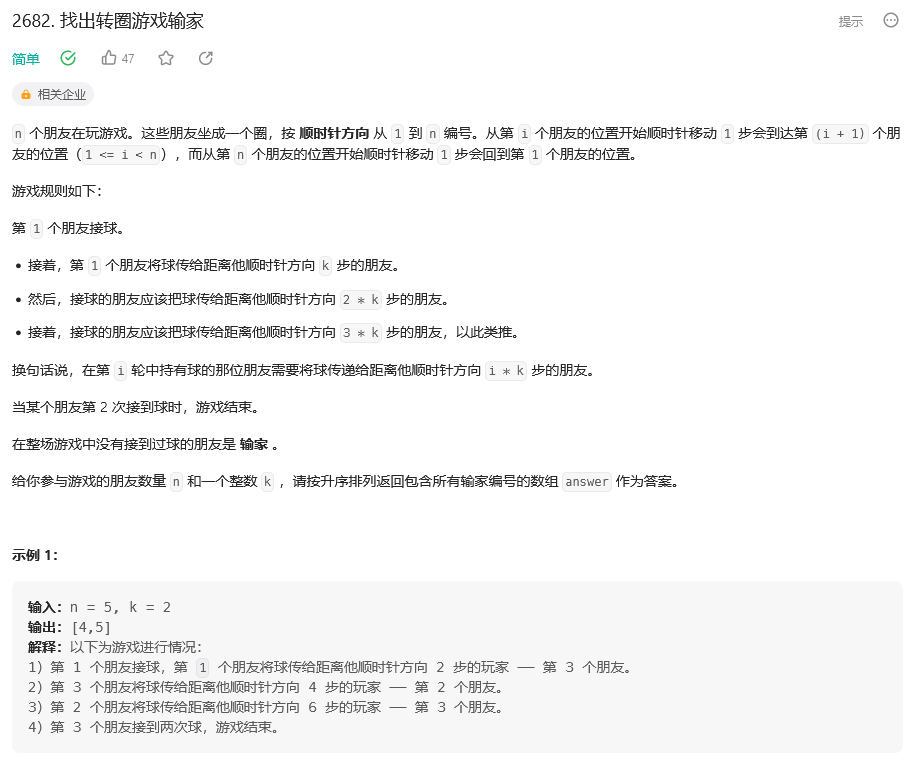

&emsp;&emsp;这道题目最简单的做法就是模拟，n个朋友其实就可以视作有n个元素的有序数组，下标来表示朋友的编号，用这个数组内的元素来表示这个朋友有没有被传球，然后在循环内判断有没有是否有人第二次被传球，也就是判断数组内的元素，0代表没传过球，1代表已经传过球了。
&emsp;&emsp;其中一个相对难以想通的就是传球这个步骤，因为题目中的朋友是围成了一个圈，而数组长度却是有限，所以就用cur来代表当前下标，用i来表示传的次数，所以可以写成
```
cur = (cur+i*k)%n
```
&emsp;&emsp;这样很清晰的表示出了当前下标，也不会越界，接下来只要对数组做一个遍历就好了，整体代码如下：
```
class Solution:
    def circularGameLosers(self, n: int, k: int) -> List[int]:
        players = [0]*n
        players[0] = 1
        cur = 0
        i = 1
        while True:
            cur = (cur + i*k) % n
            if players[cur]:
                break
            players[cur] += 1
            i += 1
        return [j+1 for j in range(n) if not players[j]]
```