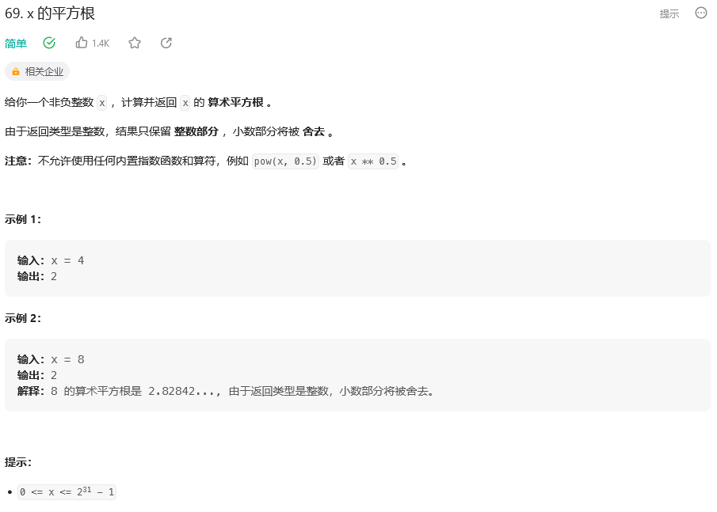

&emsp;&emsp;首先从题目来看，是返回一个非负整数的平方根，结果只保留整数部分。
&emsp;&emsp;最简单的思路就是一次遍历，一个for循环从零遍历到x/2，因为是平方根，所以x这个数的平方根必然会大于或是等于x/2，只要一直遍历到有一个数的平方大于x时，那么x的平方根必然是当前遍历到的这个数-1，因为只保留整数部分，代码如下：
```
class Solution:
    def mySqrt(self, x: int) -> int:
        for i in range((x//2)+2): #加2是为了防止x等于2、4的时候出错
            if i**2 > x:
                return i-1
            elif i**2 == x:
                return i
```
&emsp;&emsp;但是执行结果很明显，一个一个遍历肯定是超出了时间限制，即便是把范围减小了一般。
&emsp;&emsp;而这个时候，我们可以转换一下思虑，找出平方根实际上就是从0到x/2中找出这个给数，这样就比较清晰了，直接使用二分，不断的缩小查找范围来找到这个数，mid=l+(l+r)/2是为了防止溢出，因为如果是(l+r)/2，如果l如果越来越大，那么相加之后就会变成负数（但如果是py的话就不用考虑了，考虑的只有你的内存够不够大），但现在的查找范围缩小到了x/2，实际上也不会超，代码如下：
```
class Solution {
public:
    int mySqrt(int x) {
        int l = 0, r = x/2, ans =-1;
        if (x == 1) {
            return x;
        }
        while (l<=r) {
            int mid = l+(r-l) / 2;
            if ((long long)mid*mid<=x) {
                ans = mid;
                l = mid +1;
            } else {
                r = mid -1;
            }   
        }
        return ans;
    }
};
```