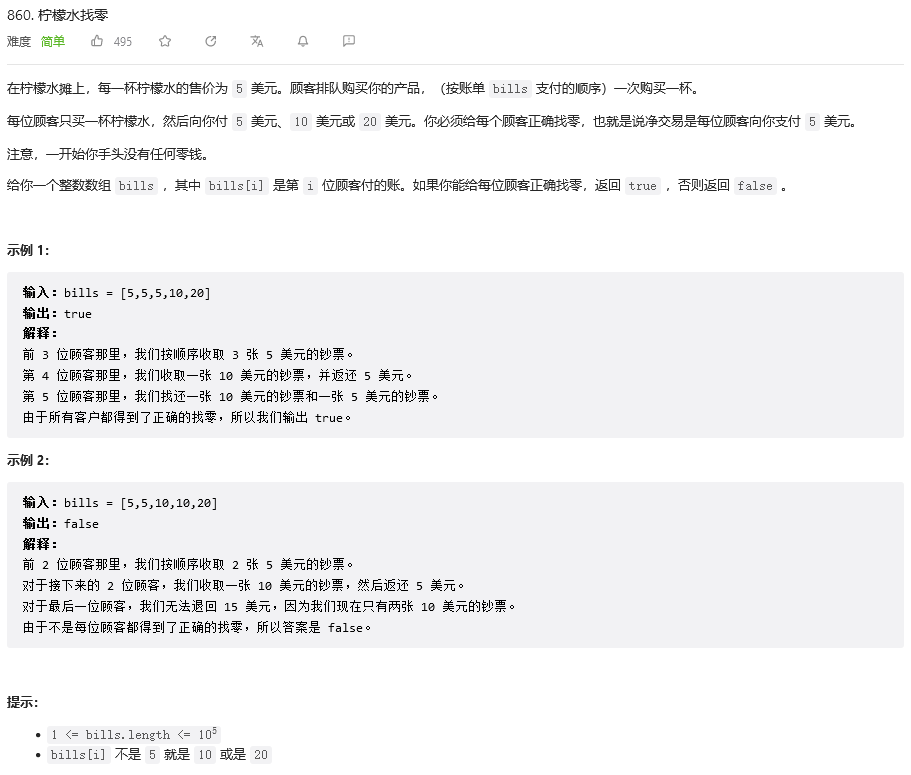

&emsp;&emsp;这道题目算是比较简单，最简单的思路就是用字典，因为题目中明确了只有三种面值的金额，所以可以用字典来记录各个面值的数量，当面值为10，20的时候，直接做相应的加减便可，同时每次循环都做判断，字典内10面值或是5面值的值是否小于零，小于零便直接返回错误，代码如下：
```
class Solution:
    def lemonadeChange(self, bills: List[int]) -> bool:
        dict1 = {'5':0,'10':0,'20':0}
        for i in bills:
            if i == 5:
                dict1['5'] += 1
            elif i == 10:
                dict1['10'] += 1
                dict1['5'] -= 1
                if dict1['5'] < 0:
                    return False
            else:
                dict1['20'] += 1
                dict1['10'] -= 1
                dict1['5'] -= 1
                if dict1['5'] < 0:
                    return False
                if dict1['10'] < 0:
                    return False
        return True
```
&emsp;&emsp;但这个时候提交会报错。

&emsp;&emsp;这是为何？调试后得知，20面值可以有两种找法，算是自己疏忽大意，找到了问题所在再做一个简单判断就好了，判断字典中的10对应的值是否大于零，不大于零就找三张五块，代码如下：
```
class Solution:
    def lemonadeChange(self, bills: List[int]) -> bool:
        dict1 = {'5':0,'10':0,'20':0}
        for i in bills:
            if i == 5:
                dict1['5'] += 1
            elif i == 10:
                dict1['10'] += 1
                dict1['5'] -= 1
                if dict1['5'] < 0:
                    return False
            else:
                dict1['20'] += 1
                if dict1['10'] > 0:
                    dict1['10'] -= 1
                    dict1['5'] -= 1
                else:
                    dict1['5'] -= 3
                if dict1['5'] < 0:
                    return False
                if dict1['10'] < 0:
                    return False
        return True
```
&emsp;&emsp;后面我看了一下题解，发现其实根本用不到字典，只需要记录面值5和10的数量便可，具体思想和上面还是一样的，代码如下：
```
class Solution {
public:
    bool lemonadeChange(vector<int>& bills) {
        int five = 0, ten = 0;
        for (int v : bills) {
            if (v == 5) five++;
                
            else if (v == 10) ten++,five--;
            else if (ten) ten--, five--;
            else five -= 3;
            if (five < 0) return false;
        }
        return true;
    }
};
```
但是为啥显示c++居然比py慢还用的内存多？
