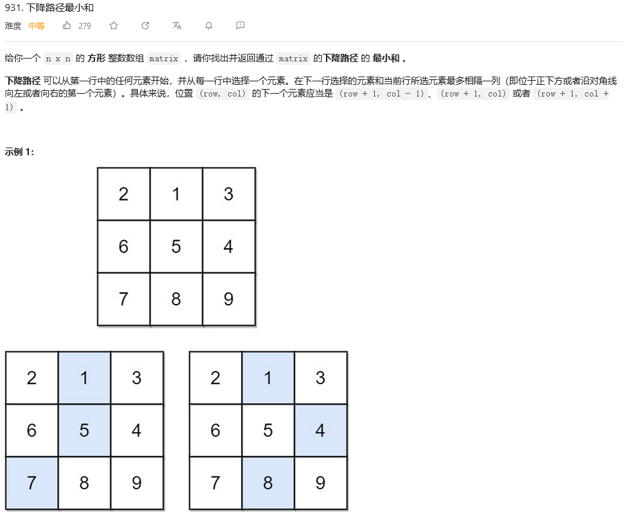
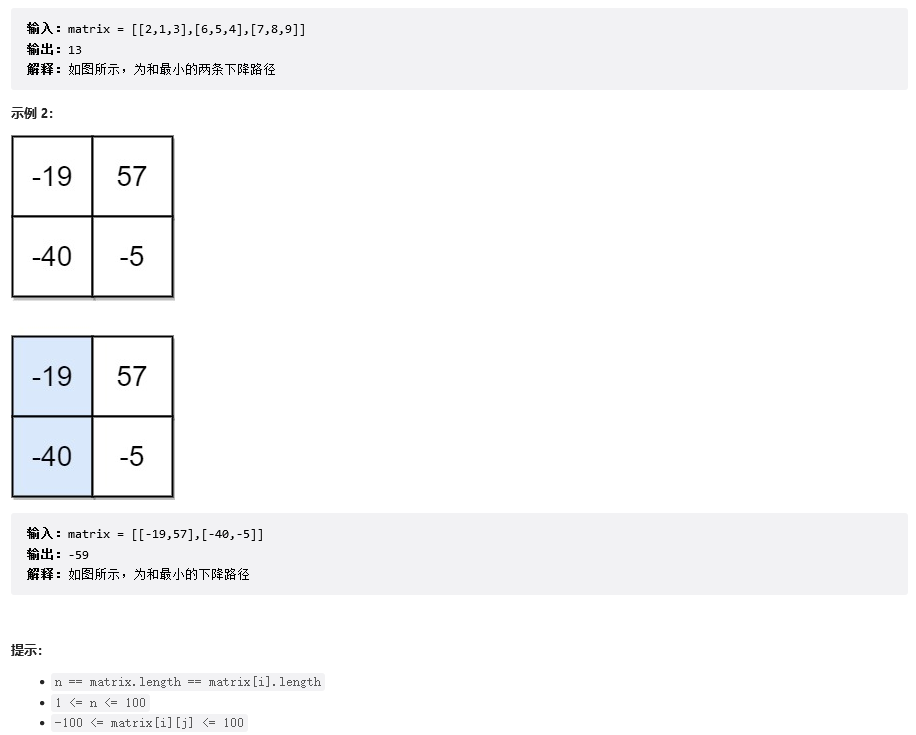

&emsp;&emsp;这道题目算是我写的很有疑问的，留作以后思考，现在已经是混头了，从题意上看，大致就是求最小的一个和，最简单的思想就是进行一个模拟，但是要考虑col的特殊情况，比如说col为0或是len(matrix)-1这个位置时，考虑边界。下面是我的一个代码：
```
class Solution:
    def minFallingPathSum(self, matrix: List[List[int]]) -> int:
        ans = float("inf")
        for i in range(len(matrix[0])):
            j = 1
            cnt = matrix[0][i]
            while j<len(matrix):
                if i != 0 and i != len(matrix[0])-1:
                    n = min(matrix[j][i-1],matrix[j][i],matrix[j][i+1])
                    col = i-1
                    while True:
                        if n == matrix[j][col]:
                            i = col
                            break
                        else:
                            col += 1
                    cnt += n
                else:
                    if i == 0:
                        n = min(matrix[j][i],matrix[j][i+1])
                        col = i
                    else:
                        n = min(matrix[j][i-1],matrix[j][i])
                        col = i-1
                    while True:
                        if n == matrix[j][col]:
                            i = col
                            break
                        else:
                            col += 1
                    cnt += n
                j+=1
            ans = cnt if cnt < ans else ans
        return ans
```
最终执行结果如下，不知道是不是我理解的题意有误，我自己人工算了一边也是-32，应该是我那里理解错了，等以后再思考吧，今天已经是弄得我头晕了，做个记录先！
