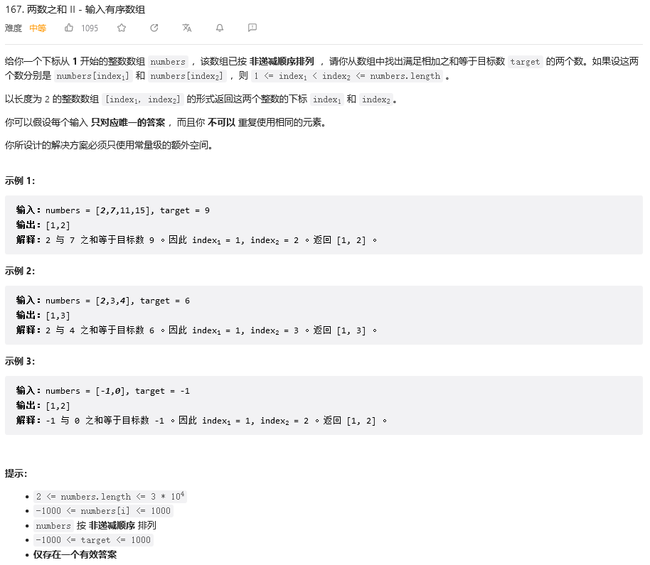

&emsp;&emsp;这道题目可以用双指针来做，题目说到了只存在唯一对应的答案且已排好了序，所以不用多做其他的考虑，头指针i与尾指针j分别向内移动，同时相加与target比较因为有序，所以number[i]+number[j] > target时，尾指针j向前移动，而number[i]+number[j] < target时，头指针则是向后移动，一直到number[i]+number[j] = target为止，时间复杂度最大也只是O（n），代码如下：
```
class Solution {
public:
    vector<int> twoSum(vector<int>& numbers, int target) {
        int i = 0, j=numbers.size()-1;
        while (i<=j) {
            if (numbers[i] + numbers[j] == target) {
                return {i+1,j+1};
            } else if (numbers[i] + numbers[j] > target) {
                j--;
            } else {
                i++;
            }
        }
        return {-1,-1};

    }
};
```
