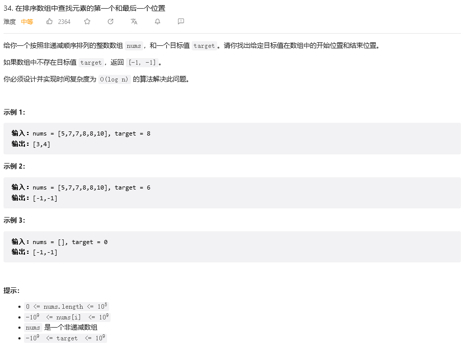

&emsp;&emsp;很显然，这道题目可以使用双指针来做，一次遍历，时间复杂度O（n），一个指针从头开始搜查，一个指针从尾部开始搜查，但并不是最优，因为数组的长度为10^5，题目的要求时间复杂度为O(log n)，明显一次遍历会超时。
&emsp;&emsp;这个时候可以注意到题目是给我们排好序的，那么就可以使用二分，先去找到target值的位置，再让原本的两个指针都指向mid，一个向前，一个向后，这样就可以找到target的起始位置了，代码如下：
```
class Solution:
    def searchRange(self, nums: List[int], target: int) -> List[int]:
        i, j = 0, len(nums)-1

        while i<j:
            mid = i+(j-1)//2
            if nums[mid] < target:
                i = mid + 1
            elif nums[mid] > target:
                j = mid - 1
            else:
                i, j = mid, mid
                while nums[i-1] == target:
                    i -= 1
                while nums[j+1] == target:
                    j += 1
                return i, j
        return -1, -1
```