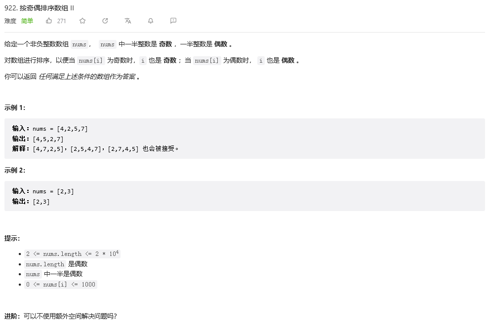

&emsp;&emsp;首先创建两个数组标记i，j分别为新数组ans的奇数下标和偶数下标，题目并不要求按大小排序，所以可以直接遍历nums数组中奇数直接进ans[j]，偶数就是ans[i]，具体代码如下：

```
class Solution:
    def sortArrayByParityII(self, nums: List[int]) -> List[int]:
        i, j = 0, 1
        ans = [0]*len(nums)
        for n in range(len(nums)):
            if nums[n] % 2 == 0:
                ans[i] = nums[n]
                i += 2
            else:
                ans[j] = nums[n]
                j += 2
        return ans
```
&emsp;&emsp;然后考虑其进阶，直接在原数组中进行修改，首先还是两个奇偶标记j，i，然后进行遍历，如果nums[i]为奇数时，就进行nums[j]的遍历，如果nums[j]为奇数，则看nums中的下一个奇数下标的数，如果是偶数则二者进行交换，具体代码如下：
```
class Solution:
    def sortArrayByParityII(self, nums: List[int]) -> List[int]:
        j = 1
        for i in range(0,len(nums),2):
            if nums[i] % 2 != 0:
                while nums[j] % 2 != 0:
                    j += 2
                nums[i], nums[j] = nums[j], nums[i]
        return nums
```
