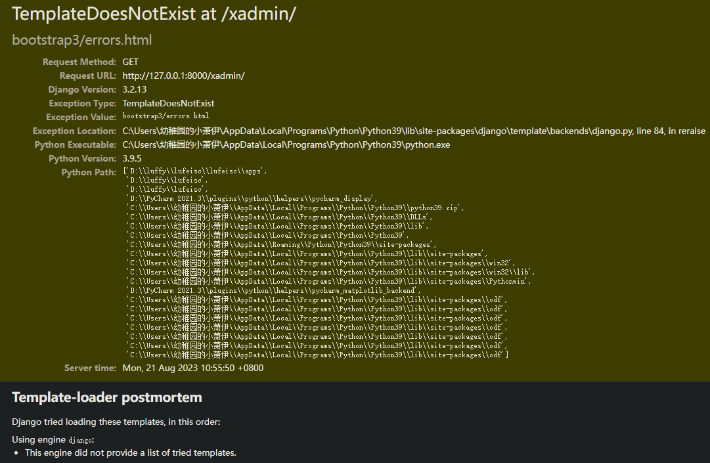

## 今天python安装xadmin时，执行数据迁移命令出现错误，竟出现惊天bug！

&emsp;&emsp;报错信息也很明显，就是没有办法从django的utils中引入six模块，具体的方法要不就是去修改源码，直接在xamdin\sites文件中导入six，(安装pip install six后再修改)，要不就是将six.py文件复制进utils，网上查询是因为django版本升级导致six的移除

&emsp;&emsp;再次执行迁移文件，问题完美解决，没有再报这个错误了。

&emsp;&emsp;但是！新的问题又来了！

&emsp;&emsp;xamdin又有包倒不了，我真是服了是我安装版本不对还是啥啊！bug一个接一个，我TM！

&emsp;&emsp;幸好，在万能的百度的帮助之下，再次成功解决，用下面的导入做个替换就好了。
```
from six import python_2_unicode_compatible
```
&emsp;&emsp;替换
```
from django.utils.encoding import python_2_unicode_compatible
```
&emsp;&emsp;&搞了半天还是six.py文件的问题，之后再执行迁移文件命令，这个问题也是成功解决，我知道你在期待什么！果不其然，他还是报错了，我想应该是我django版本的问题，4.0果然不是那么的好用，就很烦！


&emsp;&emsp;无力吐槽，再次求助百度，我想我已经具备了一个合格程序员的素养，面向百度编程！

&emsp;&emsp;惊喜！找到了一篇大佬的帖子，收录了xamdin的bug集，但是却在csdn上，哭笑不得，哈哈，csdn也算是解决了我不少问题，

&emsp;&emsp;网址：https://blog.csdn.net/dangfulin/article/details/116785621
(我一截屏就让我登录，登你个锤子！还不让我复制！本来就烦！)

&emsp;&emsp;上面的这个问题也解决了，万能的网友直接将这个包注释掉了，还真就不报错了！很强！但是希望后面别连锁反应！


&emsp;&emsp;我都懒得吐槽了，后面全是报错啊！还好查到了一个大佬有和我一样的经历！也是错了同一个地方，幸好有前人栽种的树，不然我这水平还真搞不定，感谢那些大佬！记一下帖子的原址，说不定以后参加工作了用得。https://blog.csdn.net/weixin_43865334/article/details/115071848

&emsp;&emsp;看了一下后面，二十几个错误，已经不想说啥了，做个记录算了。


&emsp;&emsp;解决方法


&emsp;&emsp;下一个


&emsp;&emsp;解决方法，先安装，在修改导包路径

```
pip install django-advanced-filters
```


&emsp;&emsp;下面是一个相同的错误，但又有点不同，但还是可以解决


&emsp;&emsp;具体修改如下：

```
# from django.db.models import FieldDoesNotExist, Avg, Max, Min, Count, Sum
from django.db.models import Avg, Max, Min, Count, Sum
from django.core.exceptions import FieldDoesNotExist
```


```
# from import_export.admin import DEFAULT_FORMATS, SKIP_ADMIN_LOG, TMP_STORAGE_CLASS
from import_export.admin import DEFAULT_FORMATS, ImportMixin,ImportExportMixinBase
```

&emsp;&emsp;终于！终于！成功啦！万幸！xadmin也没有问题！放炮！放大鞭炮！


&emsp;&emsp;总结一波吧，这也算是一次比较宝贵的经验，比较也算是修改了众多的源码，主要出现的问题实际上也就是导包的问题，如果说不用4.0的版本，或许都不会出这种问题，哈哈哈，以后都可以和面试官吹逼了，嘿嘿，不过还是在前面大佬的基础上，才有了这么一次宝贵的经历，再次感谢大佬！

&emsp;&emsp;今天在使用xadmin方法中，又出现了错误，如下图：

&emsp;&emsp;控制台报错为:
```
django.template.exceptions.TemplateDoesNotExist: bootstrap3/errors.html
```

&emsp;&emsp;网上查了下，还是由于版本问题，具体解决方法是将用到了bootstrap3/errors.html的页面直接注释掉，其一是在xadmin\templates\xadmin\views\login.html,，另一个是xadmin\auth\password_reset\form.html


