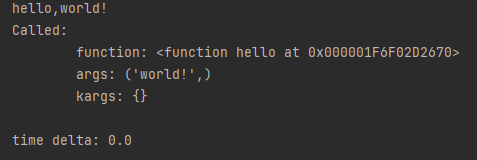

## 自己对于闭包和装饰器的一些理解
#### 代码来源：python核心编程第二版第十一章


```
from time import time

def logged(when):
    def log(f, *args, **kargs):
        print("""Called:
        function: %s
        args: %r
        kargs: %r
        """ % (f,args,kargs))
    def pre_logged(f):
        def warpper(*args,**kwargs):
            log(f,*args,*kwargs)
            return f(*args,**kwargs)
        return warpper

    def post_logged(f):
        def warpper(*args,**kwargs):
            now=time()
            try:
                return f(*args,**kwargs)
            finally:
                log(f,*args,**kwargs)
                print("time delta: %s"%(time()-now))
        return warpper

    try:
        return {"pre": pre_logged,
                "post": post_logged}[when]
    except KeyError:
        raise KeyError('must be "pre" or "post"')

@logged("post")
def hello(name):
    print("hello,%s"%name)

hello("world!")
```

##### 输出如下



&emsp;&emsp;首先看整体代码方面，logged()函数中再次定义了三个函数log()、pre_logged()、post_logged()，首先看log()函数，就是一个普通的打印函数，用来打印传入的函数信息与参数，log()函数的参数分别是f, *args, **kargs，其中f代表一个对象，*args是作为可变参数的列表来进行传参，可以把这个参数理解为一个元组tuple，**kargs参数同样也是一个可变参数，可以理解为一个字典，这两个参数解决的解决了python函数重载的问题，不需要改变参数的个数，然后%r是一个万能的格式，能够将参数的原样打印出来，%s不用多说，输出的是字符串信息，但是为什么输出的信息是一个长串呢？这个稍后写。

&emsp;&emsp;然后是pre_logged()函数，它和post_logged()二者一样，其中都有一个闭包函数warpper()，pre_logged()中的warpper()只是简单调用了log()函数，进行一个信息的打印，然后再返回f()函数，再对函数f()进行一个调用，pre_logged()函数的最后，返回了warpper，也是对warpper()函数进行了一次调用，在pre_logged()内形成了一个闭环。

&emsp;&emsp;post_logged()函数看起来比较复杂，但实际上还是比较清晰，它也是具有一个闭包函数warpper()，warpper()函数中首先便是用now值来对函数被调用时此刻的时间做了一个记录，然后再运行try，对f()函数进行一个调用，最后再运行finally中的代码，调用log()函数，做一个信息的打印，同时最后再利用time()打印post_logged()函数的执行所用时间，在post_logged()函数的最后，在对warpper()函数进行调用，这与pre_logged()函数是一样的。

&emsp;&emsp;接下来就是logged()函数中最巧妙的地方了，首先logged()函数本身就具备一个参数when，同时使用try/except来进行一个参数方面异常捕捉，try里面的代码由when这个参数来决定对哪个函数进行执行，如果when不是"pre"或是"post"这两个值，那么将会触发键异常的信息，然后打印提前准备好的错误信息，提示用户使用正确的键。使用try/except的好处在于你即便是代码某个地方出错了，也能够让整个程序执行下去，同时对于出错的地方更加明显，还可以自主更改报错信息。而这里的raise是用来手动抛出异常，但使用raise手动抛出的异常并不会让程序崩溃。

&emsp;&emsp;接下来也是整个代码块最关键的地方，logged()函数作为一个装饰器装饰了还在定义的hello()函数，在装饰器装饰一个函数时，基本可以看成是这种形式logged(hello())，被装饰的函数作为一个参数传给了logged()，这样logged中的f()代表的就是被装饰的函数。

&emsp;&emsp;使用装饰器的好处有很多，首先你可以在不改变被装饰函数的主体下，给被装饰函数增加功能，但装饰器也有缺点，被装饰函数的对象属性都会被替换掉，同时，如果想要被装饰的函数带上参数，装饰器内的函数也要带上参数如f(*args,**kwargs)，这样就不会报错。